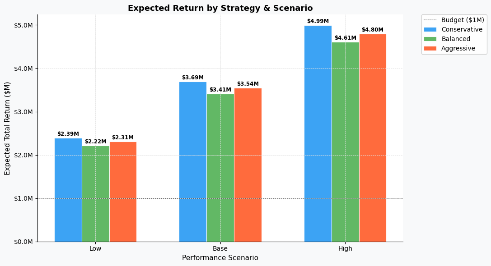

# Charts & Visualizations

Four charts are generated by `budget_analysis.py` and saved to the `results/`
folder. Each chart answers a distinct analytical question about budget
allocation strategy.

---

## Chart 1 — Expected Return by Strategy & Scenario

A grouped bar chart showing the average simulated return for each strategy
across all three performance scenarios.

Conservative leads in every scenario — $2.39M (Low), $3.69M (Base), and
$4.99M (High). The gap between strategies widens as conditions improve,
with Conservative pulling $380,000 ahead of Balanced in the High scenario.
The dotted line marks the original $1M budget, showing that every strategy
more than doubles the budget in Base and High conditions. This chart
establishes the core finding: Conservative is not just the safest choice,
it is also the highest-returning one.

---

## Chart 2 — Return Distribution, Base Scenario

A notched boxplot showing the full distribution of 2,000 simulated returns
per strategy under Base conditions. The notch represents the 95% confidence
interval around the median.

Conservative has the highest median and the tightest interquartile range,
meaning its typical outcome is both better and more predictable than the
alternatives. Aggressive has the widest box and the longest upper whisker,
confirming that its upside ceiling comes with a wider spread of outcomes.
Balanced sits between the two but leans closer to Aggressive in terms of
spread. No strategy produces an outcome below budget in this scenario,
as shown by the dotted $1M reference line well below all distributions.

---

## Chart 3 — Risk vs. Return, All Strategies & Scenarios

A scatter plot mapping each of the nine strategy × scenario combinations
by risk (standard deviation of return on the x-axis) and expected return
(average return on the y-axis). Marker shape encodes scenario — downward
triangle for Low, circle for Base, upward triangle for High. Color encodes
strategy.

The chart reveals a clear structure. All three Low scenario points cluster
in the bottom left — low risk, low return. Base and High points spread
rightward as volatility increases with higher market conditions. Conservative
sits above both alternatives at every scenario level, meaning it achieves
higher expected return at lower or comparable risk. Aggressive consistently
sits furthest right — accepting the most risk — without achieving higher
average return to compensate. The dotted $1M line confirms no combination
ever approaches a loss.

---

## Chart 4 — Budget Allocation by Channel & Strategy

A stacked bar chart showing how each strategy distributes the $1M budget
across the five channels, expressed as a percentage.

The differences in strategy philosophy are immediately visible. Conservative
dedicates 35% to Content/SEO — the largest single allocation in the entire
project — and keeps Social Media at just 5%. Balanced spreads budget with no
channel below 15% or above 25%, reflecting its even-distribution philosophy.
Aggressive puts 30% each into Content/SEO and Events & Partnerships, making
it the only strategy that maxes out the high-volatility Events channel. This
chart is the starting point for understanding why the strategies perform
differently — the allocation decisions made here drive every result in the
analysis.
